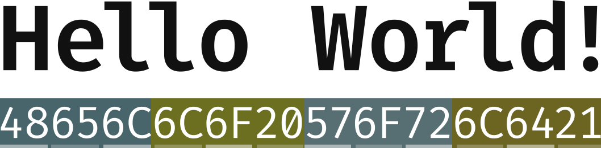

# Pixel Color Cipher (PCC)
*The Pixel Color Cipher is a method for encoding text or hexadecimal data in an image block.*

## About
PCC is a cipher method that takes ASCII/Unicode text or hexadecimal data and converts it to a PNG image. Every pixel on the image represents, at max, 3 ASCII letters.  
  
  
  
In this diagram, the text "Hello World!" is converted to hex from ASCII and every two hex digits is combined into a group of six characters. This grouping forms a hex representation of a web RGB color. When this is converted to a PCC image, this is what it looks like (enlarged 10,000% from its original size):
  
  
  
Each pixel block in this image represents 3 ASCII characters.

### Intentions
When I first came up with the idea for PCC, I had no particular idea in mind for how it could be used. I encourage everyone who's interested in PCC to utilize it wherever they deem fit. I simply thought that storing text and hex data in this way could lead to an interesting result.

## Addl. Findings
In one test using a large (996 characters) paragraph, I found that from encoding the ASCII text to a PCC image, a loss of approx. 7.6 percent was found in the PCC image. After conducting additional tests using text of varying lengths and character sets, an average loss of 14.1% can be found after converting the text to a PCC image. However, using short strings of text results in an opposite effect, with the image being larger than the text, as seen in test 2 (the "Hello World!" example).  

## Python Code Overview
In the `py/pcc.py` file is the Python implementation of the PCC system. In this file are 4 functions: `encode_text` for encoding ASCII or Unicode text to a PCC image, `encode_hex` for encoding a hexadecimal string to a PCC image, `decode_file` for decoding a PCC image to a hexadecimal string, and `convert_hex` for converting a hex string to ASCII or Unicode characters.

### Code Breakdown
This Python implementation only uses one external library, Pillow, for image generation and interpretation.

I encourage anyone and everyone to cleanup this code and/or port it to other systems and languages so that PCC may be able to be used in any environment.

(***NOTE:*** *Please don't judge my Python code too harshly. I am well aware that it could more than likely be optimized and improved much more than its current state. I encourage anyone to submit a pull request if they want to help optimize the code.*)

#### **Generate an Image**
To generate a PCC image from an ASCII or Unicode string, you must first convert that sting into a Unicode-encoded hex string. Next, calculate the image's width and height by using the length of the hex string. PCC images have a 32 pixel width at maximum, but the height is unlimited (within reason).

Once you've calculated and stored the image's size (into the `LGTH` and `HIGT` variables for width and height, respectively), next you need to split the hexadecimal string into 6-character length sections, each eventually representing a color. Once the hex string has been split, you now need to convert the hex color values into the web RGB format (###, ###, ###) and append these values to a list of tuples so that you can use Pillow to generate the image.

Lastly, simply use `putdata()` to generate the final image and save!

#### **Decode an Image**
To decode a PCC image to hex, simply grab the image data and iterate over every pixel, starting from the top-leftmost and all the way to the bottom-rightmost pixels. For every pixel, convert the RGB color value to a hexadecimal color value and store these in a string. Lastly, simply print this output!

#### **Convert the Hex Output to Text**
To convert the hexadecimal output to ASCII or Unicode text, simply reference [this character table](https://en.wikipedia.org/wiki/List_of_Unicode_characters) and convert the hex to text. Python has built-in systems for this purpose.

## License
This system, along with the provided Python implementation, is licensed under [The Unlicense](http://unlicense.org). I hereby relenquish **ALL** rights to this system and code and allow anyone to modify, reproduce, copy, distribute, or even sell anything related to PCC and its code. I encourage anyone to utilize this system for anything and even modify it further if they so choose.
